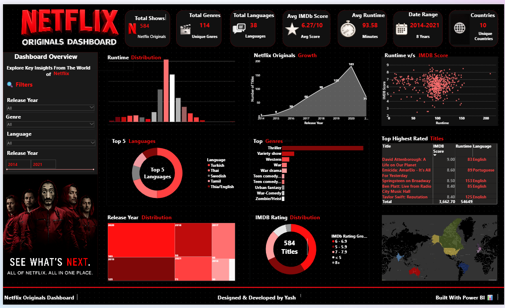

# Netflix Power BI Dashboard

## Project Overview

This Power BI dashboard analyzes Netflix content to uncover trends in movies and TV shows. It provides interactive visualizations to explore genres, ratings, countries, release years, and content distribution.

---

## Objectives

- Analyze Netflix content.
- Compare Movies and TV Shows.
- Discover the most popular genres.
- Explore country-wise content distribution.
- Analyze release trends over the years.
- Understand content ratings.

---

## Tools Used

- Power BI
- Power Query
- DAX
- Microsoft Excel

---

## Dataset

Netflix Originals Dataset (Kaggle)

---

## Key Insights

- Movies make up a larger share of Netflix's content library.
- Drama and International content are among the most common genres.
- The United States contributes the highest amount of content.
- Most titles were released during the last decade.
- Interactive filters allow users to explore the data dynamically.

---

## Dashboard Preview

---

## Project Files

- Netflix-Dashboard.pbix
- NetflixOriginals.csv
- netflix-dashboard.png

---

## Author

**Yash Dalvi**

Aspiring Data Analyst
